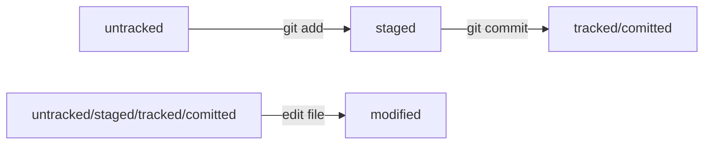

# всем привет это мой первый проект

## текст поменьше

### описание

_данный проект является **пробным**_

```
print('hello world')
```

[vk](https://vk.com/feed "сайт вк")

#Практическая работа номер 2. Хеш, логи и тд

##Хеш

Хеш это уникальный набор цифр, зависящий от содержания коммита (_если коммит в одном месте совпадает с коммитом в другом месте, то хеш будет одинаковым_)

Все хеши хрантяся в папке .git

##Лог


Чтобы вызвать лог, используем команду git log
Чтобы вызвать сокращенный лог, используем команду `git log` с фдагом --oneline

##HEAD


HEAD - служебный файл, который хранит информацию о последнем коммите, а именно его хеш, с каждым новым коммитом содержание HEAD обновляется

Чтобы узнать полследний хеш нужно использовать команаду cat refs/heads/master

##Статусы файлов в Git


Существует 4 статуса файлов: Untracked/Tracked, staged, modified




##Оформление сообщений
  


